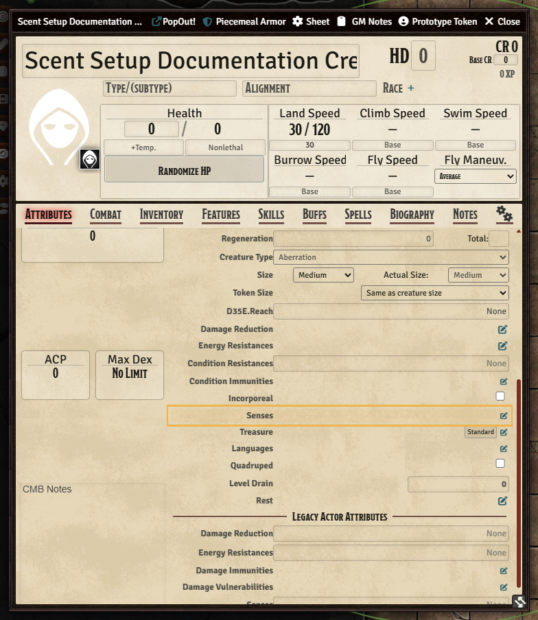
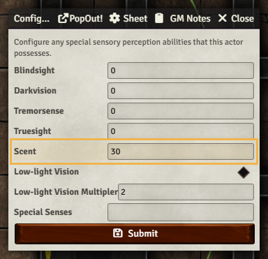
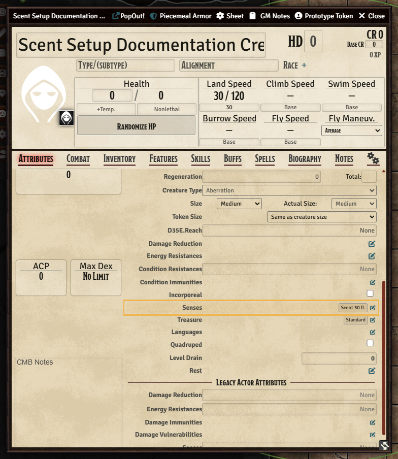

# Quick Start Guide

`d35e-scent-sense` is a conservative GM aid for Scent in D35E worlds. It automates repeatable range and state checks, then leaves table-judgment calls visible to the GM.

For the complete public manual, see [`USER_MANUAL.md`](USER_MANUAL.md).

## 1. Install

Use the release manifest URL in Foundry VTT Setup:

```text
https://github.com/SpencerZPoole/d35e-scent-sense/releases/latest/download/module.json
```

Then open a D35E world, enable **D35E Scent Sense** in **Manage Modules**, and reload when Foundry asks.

## 2. Give A Token Scent

For normal use, give Scent to the actor through the D35E sheet before testing
alerts, rings, or trails:

1. Open the actor sheet or a placed token's actor sheet.
2. Open the **Attributes** tab.
3. Scroll down to the **Senses** row in the Traits area.
4. Click the pencil icon on the **Senses** row.
5. In the Senses configuration window, enter the range in **Scent**.
6. Click **Submit**.





After saving, the actor sheet should show a `Scent 30 ft.` style badge on the
**Senses** row if you entered `30`.



The module reads that D35E sheet value from `system.attributes.senses.scent`.
D35E may also prepare the same range at `system.senses.scent`; the module checks
both locations and uses the highest positive value it finds. Eligible item sense
data can also grant Scent, but the actor-sheet path above is the clearest setup
path for a GM or player.

A positive range makes the actor a Scent-capable source. The module also syncs a
`scentPinpoint` token detection mode at the 5 ft pinpoint range.

Use `game.d35eScentSense.getScentRangeBreakdown(actorOrToken)` when a token does not behave as expected. The diagnostic reports contributing sources, ignored sources, and token sync status.

## 3. Check Alert Scope

The default alert scope is conservative: unknown hostile targets. In practice, hidden or invisible hostile tokens can trigger owner alerts. GMs can change the scope in module settings to all hostiles, all creatures, or GM-marked hostiles.

## 4. Use Scent Context

Open **Scent Menu** from Token Controls as GM, then use **Advanced Scent Context** to edit scene defaults and token overrides for:

- wind band
- odor strength
- masking odor
- false odor
- odor tags
- GM-marked Scent relevance

Selecting `inherit` clears that token or scene flag. Actor flags remain readable for inheritance but are not edited by this UI.

## 5. Use Scent Trails

Open **Scent Menu** from Token Controls as GM to manage scene trail records. The top of the menu lists active trails before creation controls so the GM can quickly see what already exists, whether movement recording is enabled, who can see the trail, and whether the path has recent recorded segments.

Use **Create / Enable Trail** to choose the token emitting the odor trail. New trails record that token's movement by default. The GM can disable recording, hide or reveal the trail preview to players, edit trail context, save changes, or delete the trail and its recorded path segments.

Use **View Scent Trails** in Token Controls, or the preview button inside the Scent Menu, to toggle trail path graphics. The GM sees active trail paths by default. Players only see trails that the GM explicitly marks visible to players.

The Trail Manager can preview tracking DCs for a selected scent-capable tracker and create a redacted Survival prompt. Player-facing prompts do not reveal hidden trail source details by default.

## 6. Know The Boundary

The module does not spend actions, decide every direction call, identify hidden creatures for players, or reveal trail paths to players unless the GM enables that visibility. Those calls remain GM-adjudicated.

## More Help

- Full manual: [`USER_MANUAL.md`](USER_MANUAL.md)
- API reference: [`API_REFERENCE.md`](API_REFERENCE.md)
- RAW coverage matrix: [`RAW_COVERAGE_MATRIX.md`](RAW_COVERAGE_MATRIX.md)
- UX improvement plan: [`UX_IMPROVEMENT_PLAN.md`](UX_IMPROVEMENT_PLAN.md)
