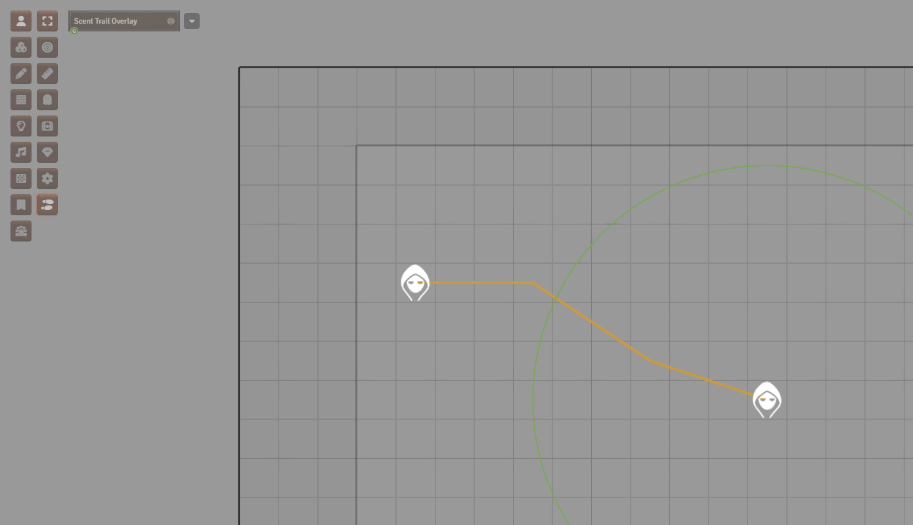

# Quick Start Guide

`d35e-scent-sense` is a conservative GM aid for Scent in D35E worlds. It automates repeatable range and state checks, then leaves table-judgment calls visible to the GM.

For the complete public manual, see [`USER_MANUAL.md`](USER_MANUAL.md).

## 1. Install

Use the release manifest URL in Foundry VTT Setup:

```text
https://github.com/SpencerZPoole/d35e-scent-sense/releases/latest/download/module.json
```

Then open a D35E world, enable **D35E Scent Sense** in **Manage Modules**, and reload when Foundry asks.

## 2. Give A Token Scent

For normal use, give Scent to the actor through the D35E sheet before testing
alerts, rings, or trails:

1. Open the actor sheet or a placed token's actor sheet.
2. Open the **Attributes** tab.
3. Scroll down to the **Senses** row in the Traits area.
4. Click the pencil icon on the **Senses** row.
5. In the Senses configuration window, enter the range in **Scent**.
6. Click **Submit**.


After saving, the actor sheet should show a `Scent 30 ft.` style badge on the
**Senses** row if you entered `30`.


The module reads that D35E sheet value from `system.attributes.senses.scent`.
D35E may also prepare the same range at `system.senses.scent`; the module checks
both locations and uses the highest positive value it finds. Eligible item sense
data can also grant Scent, but the actor-sheet path above is the clearest setup
path for a GM or player.

A positive range makes the actor a Scent-capable source. The module also syncs a
`scentPinpoint` token detection mode at the 5 ft pinpoint range.

Use `game.d35eScentSense.getScentRangeBreakdown(actorOrToken)` when a token does not behave as expected. The diagnostic reports contributing sources, ignored sources, and token sync status.

## 3. Check Alert Scope

The default alert scope is conservative: unknown hostile targets. In practice, hidden or invisible hostile tokens can trigger owner alerts. GMs can change the scope in module settings to all hostiles, all creatures, or GM-marked hostiles.

## 4. Create Scene Scent Sources

Open **Scent Menu** from Token Controls as GM. The menu is one page:

- **Create New Scent Source** is at the top.
- **Scene Scent Sources** is below it and lists only sources the GM has created for this scene.

Create a source when a token gives off an odor you want the module to track. The main fields cover the table controls used most often: odor strength, wind, masking odor, water state, competing odor, manual DC modifier, player visibility, and **Source leaves trail**. Use **Advanced GM details** for false odor, odor tags, and notes.

Masking odor is the main mechanical suppressor: when it applies, Scent detection for that target/source context is blocked. False odor and odor tags are intentionally quieter helper fields. They can support GM notes and familiar-odor checks, but they do not automatically identify creatures, mislead players, or change Scent range by themselves.

**Source leaves trail** means future movement by that token records path segments. Movement before the source exists is not backfilled.

## 5. View Trails From Sources

Use **View Scent Trails** in Token Controls, or **Show/Hide Trail Preview** inside the Scent Menu, to toggle trail path graphics. The GM sees active source trails by default. Players only see trails that the GM explicitly marks visible to players.



Tracking DC helper APIs remain available for macros and future UI work. The Scent Menu itself stays focused on source setup, source editing, and trail visibility.

## 6. Know The Boundary

The module does not spend actions, decide every direction call, identify hidden creatures for players, or reveal trail paths to players unless the GM enables that visibility. Those calls remain GM-adjudicated.

## More Help

- Full manual: [`USER_MANUAL.md`](USER_MANUAL.md)
- API reference: [`API_REFERENCE.md`](API_REFERENCE.md)
- RAW coverage matrix: [`RAW_COVERAGE_MATRIX.md`](RAW_COVERAGE_MATRIX.md)
- UX improvement plan: [`UX_IMPROVEMENT_PLAN.md`](UX_IMPROVEMENT_PLAN.md)
