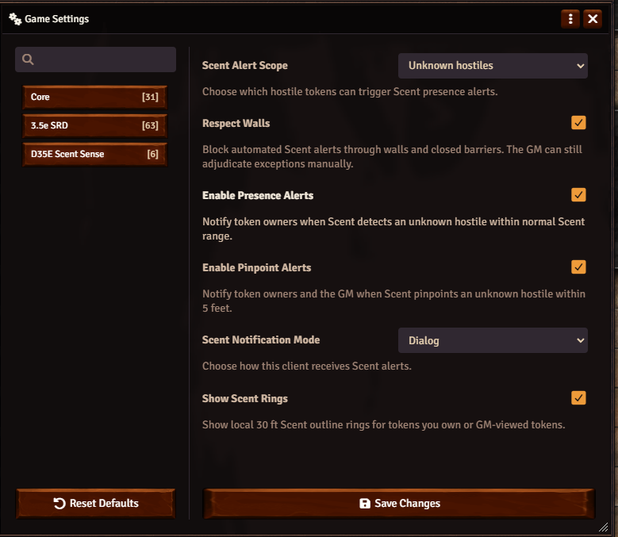

# D35E Scent Sense User Manual

This manual is the table-facing guide for installing, configuring, and using
`d35e-scent-sense` in a Foundry VTT world running the D35E system.

The module is intentionally conservative. It automates repeatable Scent checks
where the 3.5e SRD mechanics are clear, gives the GM tools for context and
tracking, and keeps judgment calls visible instead of silently deciding every
table ruling.

## Table Of Contents

- [1. Overview](#1-overview)
- [2. Requirements](#2-requirements)
- [3. Installation](#3-installation)
- [4. Updating, Disabling, And Uninstalling](#4-updating-disabling-and-uninstalling)
- [5. First Setup Checklist](#5-first-setup-checklist)
- [6. Giving A Creature Scent](#6-giving-a-creature-scent)
- [7. Scent Detection At The Table](#7-scent-detection-at-the-table)
- [8. Settings And Controls](#8-settings-and-controls)
- [9. Scene Scent Sources](#9-scene-scent-sources)
- [10. Odor Profiles](#10-odor-profiles)
- [11. Source Trails And Tracking Helpers](#11-source-trails-and-tracking-helpers)
- [12. Diagnostics And Admin Helpers](#12-diagnostics-and-admin-helpers)
- [13. Troubleshooting](#13-troubleshooting)
- [14. Support Checklist](#14-support-checklist)
- [15. Legal And Content Boundary](#15-legal-and-content-boundary)

## 1. Overview

`d35e-scent-sense` adds Scent support for the D35E Foundry system. It registers
the Scent sense, adds 5 ft pinpoint handling, scans active scene tokens, sends
owner and GM alerts, and gives the GM Scent Source tools for wind, odor
strength, masking odors, advanced false odor/tag notes, and GM-authored visual
trails.

### What The Module Automates

- Scent range discovery from supported D35E actor and item data.
- Scent presence checks against current scene tokens.
- 5 ft pinpoint detection and token detection-mode syncing.
- Effective range helpers for wind and odor strength.
- Masking odor suppression when the GM marks it active.
- Owner and GM alert routing.
- Runtime state for presence, direction request, direction reveal, and pinpoint.
- Scent tracking DC helper values for GM-authored Scent Sources.
- Path segment recording for GM-created sources that have **Source leaves trail** enabled.
- GM-local source trail overlays, with optional GM-controlled player visibility.

### What Stays GM-Assisted

- Whether a player spends the needed table action to request direction.
- What direction or location detail the GM reveals.
- Whether an advanced false odor note or familiar odor tag should matter in the scene.
- Whether a Scent Source exists, when it starts leaving a trail, what it represents, and whether players may see it.
- Whether a roll prompt should become a real table roll.

### What Remains Manual

- Creating a Scent Source before movement can be recorded.
- Automatic hidden-creature identification for players.
- Automatic action-spending enforcement.
- Complete environmental modeling beyond the module's context fields.
- Any ruling that depends on table-specific circumstances.

## 2. Requirements

- Foundry VTT: minimum `14`, verified with `14.362`.
- D35E system: minimum `3.0.2`, verified with `3.0.2`.
- A D35E world where the module is enabled.
- GM permissions for source editing, trail viewing, migration helpers, and
  most diagnostics.

The module is distributed through GitHub releases. The current stable module
version is `1.2.0`.

## 3. Installation

### Recommended Manifest Install

1. Open Foundry VTT Setup.
2. Go to **Add-on Modules**.
3. Choose **Install Module**.
4. Paste this manifest URL:

   ```text
   https://github.com/SpencerZPoole/d35e-scent-sense/releases/latest/download/module.json
   ```

5. Confirm the install.
6. Launch a D35E world.
7. Open **Game Settings** and then **Manage Modules**.
8. Enable **D35E Scent Sense**.
9. Save module settings and reload the world when Foundry asks.

### Manual Zip Install

Use this path only if the manifest installer is unavailable.

1. Open the latest GitHub release for `SpencerZPoole/d35e-scent-sense`.
2. Download the release zip named like `d35e-scent-sense-v1.2.0.zip`.
3. Extract the zip into your Foundry user data module folder so the module
   folder is named `d35e-scent-sense`.
4. Confirm that `module.json` is directly inside that folder, not inside an
   extra nested folder.
5. Restart Foundry VTT or reload Setup.
6. Enable **D35E Scent Sense** in your D35E world.

Expected folder shape:

```text
Data/modules/d35e-scent-sense/module.json
Data/modules/d35e-scent-sense/scripts/
Data/modules/d35e-scent-sense/templates/
Data/modules/d35e-scent-sense/styles/
```

## 4. Updating, Disabling, And Uninstalling

### Updating

For a manifest install, use Foundry's normal module update flow. The stable
manifest URL always resolves to the latest published release.

For a manual zip install, replace the existing `d35e-scent-sense` module folder
with the contents of the newer release zip. Keep the same folder name and
confirm that `module.json` is still at the module root.

Module-owned scene and token flags are stored in the world, not in the module
folder, so replacing the module folder does not delete your scene context,
Scent Source records, or path segments.

### Disabling

Open **Manage Modules** in the world and uncheck **D35E Scent Sense**. The
module stops registering its runtime behavior after the world reloads. Existing
module flags remain inert unless the module is enabled again.

### Uninstalling

Disable the module in every world that uses it, then remove the
`d35e-scent-sense` module folder or uninstall it through Foundry Setup. If you
want to remove stored scene/token flags too, use Foundry's normal document tools
or a deliberate migration/cleanup script after making a world backup.

## 5. First Setup Checklist

After enabling the module in a D35E world:

1. Reload the world once.
2. Confirm **D35E Scent Sense** appears in **Manage Modules** as active.
3. Confirm the world uses the D35E system.
4. Add or verify one actor with a positive Scent range.
5. Place that actor as a token in a test scene.
6. Select the token and confirm the Token HUD can toggle the local Scent ring.
7. As GM, open Token Controls and confirm **Scent Menu** and **View Scent
   Trails** tools are available.
8. Use the console diagnostic below if Scent is not working as expected:

   ```js
   game.d35eScentSense.getScentRangeBreakdown(canvas.tokens.controlled[0])
   ```

## 6. Giving A Creature Scent

The module treats an actor or token as a Scent source when it finds a positive
Scent range from supported D35E data.

### Normal Actor-Sheet Setup

The clearest setup path is the D35E actor sheet:

1. Open the actor sheet, or open a placed token's actor sheet.
2. Open the **Attributes** tab.
3. Scroll down to the **Senses** row in the Traits area.
4. Click the pencil icon on the **Senses** row.
5. In the Senses configuration window, enter the desired range in **Scent**.
6. Click **Submit**.


After submit, the actor sheet should show a `Scent 30 ft.` style badge on the
**Senses** row if you entered `30`.


That sheet workflow writes the base D35E actor value at
`system.attributes.senses.scent`. During D35E actor preparation, the same range
may also be exposed at `system.senses.scent`. The module checks both paths, so
the actor-sheet setup above is directly connected to Scent range discovery,
alerts, rings, pinpoint sync, and trail tracking eligibility.

Supported sources include:

- D35E prepared actor senses.
- D35E base actor sense data.
- Eligible item-granted senses.
- A compatibility fallback world flag on an otherwise eligible item.

The module chooses the highest valid Scent range it finds. If a source is
ignored, the range breakdown diagnostic reports why.

For a quick confirmation, select the token and run:

```js
game.d35eScentSense.getScentRangeBreakdown(canvas.tokens.controlled[0])
```

For an actor that was given `Scent 30 ft.` through the sheet, the diagnostic
should report a `range` of `30` and a contributor from
`system.attributes.senses.scent`. It may also report a prepared contributor from
`system.senses.scent`.

### Eligible Item Sources

The item-source helper is conservative. It accepts appropriate race, class,
feat, active buff, active aura, and equipped usable equipment sources. It ignores
sources that are not active or are otherwise marked as unavailable, such as
broken, melded, or unequipped equipment.

### Pinpoint Detection Mode

When a token has Scent, the module reconciles a `scentPinpoint` token detection
mode at 5 ft. The sync is intended to be idempotent: one token should not collect
duplicate `scentPinpoint` entries.

If the token loses Scent, the module removes the synced pinpoint mode during
refresh.

## 7. Scent Detection At The Table

The module scans current scene tokens and evaluates Scent in bands and states.

### Detection States

- `none`: no Scent detection.
- `presence`: the source can smell something nearby.
- `directionAvailable`: the source can request direction information.
- `directionRequested`: the player has requested direction and the GM has been
  prompted.
- `directionRevealed`: the GM has marked the direction request resolved.
- `pinpoint`: the target is within 5 ft.

### Presence Alerts

Presence alerts tell a token owner that something is nearby. They do not reveal
the hidden target's identity to the player.

### Direction Requests

When a player chooses to request direction, the module whispers supporting
details to the GM. The GM decides what direction to reveal and can mark the
request as revealed. The module tracks the state, but it does not spend actions
or decide the direction automatically.

### Pinpoint Alerts

Within 5 ft, the module can notify the owner and GM that the source is in the
pinpoint band. The GM still controls how exact location information is described
at the table.

### Privacy Boundary

Player-facing messages are deliberately vague. GM-facing messages can include
target names, range details, context values, and trail notes so the GM can
adjudicate clearly.

## 8. Settings And Controls

Open **Configure Settings** for the module to adjust alert and overlay behavior.



### Scent Alert Scope

- **Unknown hostiles**: default. Alerts focus on hostile targets that are not
  already plainly known to the source.
- **All hostiles**: alerts can trigger for any hostile target.
- **All creatures**: alerts can trigger for all actor tokens.
- **GM-marked hostiles**: alerts use the GM's `scentRelevant` marking.

### Respect Walls

When enabled, automated Scent alerts are blocked through walls and closed
barriers. The GM can still override or adjudicate unusual circumstances manually.

### Presence And Pinpoint Alerts

The GM can enable or disable presence alerts and pinpoint alerts separately.
These settings affect automated notifications, not the underlying API helpers.

### Notification Mode

Each client can choose dialog alerts or chat-only alerts. This is a client
preference so different users can receive Scent notifications in different ways.

### Scent Rings

The module can draw local Scent range rings for tokens the current user owns or
that the GM can view. The Token HUD includes a Scent ring toggle for individual
tokens.

## 9. Scene Scent Sources

Scene Scent Sources are GM-only records for tokens that matter as odor sources
in the current scene. Open **Scent Menu** from Token Controls. The menu is one
page:

- **Create New Scent Source** at the top.
- **Scene Scent Sources** below it.

Create a source when a token gives off an odor the GM wants to manage. The
source row becomes the place to edit that token's odor behavior. The menu does
not show every token in the scene; it shows only tokens the GM has intentionally
created as Scent Sources.

### Create New Scent Source

Use the create controls to choose a source token, label the source, and set:

- odor strength
- wind band
- masking odor
- water state
- competing odor
- manual odor DC modifier
- player visibility
- whether the **Source leaves trail**

**Source leaves trail** maps to the compatible `recordMovement` field. When it
is enabled, future movement by that token records path segments. Movement before
the source exists is not backfilled.

Use **Advanced GM details** for false odor, odor tags, size/count notes, and
freeform GM notes. Those fields are useful for misleading odors, familiar-odor
helper checks, and private bookkeeping, but they do not need to compete with the
core source controls during normal play. Masking odor is the option that
mechanically suppresses detection; false odor and tags do not suppress detection
or identify creatures by themselves.

### Scene Scent Sources Table

Use this table during play. Each row edits the created source directly:

- Active controls whether the source affects live Scent behavior and trail
  display.
- Source Token can be changed if the GM picked the wrong token.
- Source Profile controls odor strength, wind, masking odor, trail recording,
  and player visibility for that source.
- Trackability shows stable GM facts: source age, path segment count, fade
  state, water state, competing odor, and manual DC modifier.
- Advanced GM details keep false odor, odor tags, size/count notes, and
  freeform context available without making every row noisy.

Source-specific odor and wind fields affect live Scent detection for that token.
The module still reads older scene/token/actor context flags for compatibility
when no active Scent Source exists for a target.

The legacy console helper `game.d35eScentSense.openContextManager()` remains
available for compatibility, but it now opens the same **Scent Menu** instead of
opening a second management window.

## 10. Odor Profiles

Odor profiles let the GM describe how a target smells without revealing identity
to players automatically.

### Odor Strength

Supported strengths are:

- `normal`
- `strong`
- `overpowering`

Strength affects effective range calculations and detection helpers.

### Masking Odor

When masking odor is active, the detection helper suppresses detection for that
target/context. Use this for table situations where another odor overwhelms or
conceals the relevant scent.

### False Odor

False odor is advanced GM-facing metadata. It helps the GM track that an odor is
misleading, but it does not automatically lie to players, suppress detection, or
identify a creature.

### Odor Tags

Odor tags are short GM-authored labels such as `wolf` or `smoke`. They support
familiar-odor helper checks. Tags are helper data, not automatic creature
identification and not range modifiers.

## 11. Source Trails And Tracking Helpers

A Scent Source can leave a trail. The module records movement path segments only
for sources the GM or API creates and leaves active with **Source leaves trail**
enabled. A token moving before a source is created does not backfill old path
geometry.

The source record stores a source reference, creation time, active state, source
profile fields, visibility flags, path segments, and notes. Odor strength is
source profile data. Tracking DC helpers still use trail age, water, competing
odor, and the manual odor DC modifier.

### Viewing Trail Paths

Use **View Scent Trails** in Token Controls, or the Show/Hide Trail Preview
button in **Scent Menu**, to toggle the local trail overlay. Both controls read
and update the same client-local overlay state.

GMs can see active source trails when the overlay is on. Players do not see trail
paths unless the GM marks that source **Visible to players**.


Trail paths fade by age. Fresh segments are strongest; old segments become faint
or hidden once they are no longer meaningfully trackable by the module's trail
age rules.

### Tracking DC And Roll APIs

The Scent Menu no longer includes a tracker preview dropdown. Tracking helpers
remain available to macros and future UI work. They consider Scent, Track
eligibility, source trail age, water state, competing odor, and odor modifier
fields.

The roll helper can still create a redacted Survival prompt when called through
the public API. Player-facing prompt text is kept limited by default. GM-facing
details can include the source label, token, odor strength, and notes.

If a native D35E skill roll method is available, the module may attempt to use
it. Otherwise it creates a prompt and returns a `not-rolled` result so the GM can
resolve the roll manually.

### Deleting Or Inactivating Sources

Delete sources that are no longer needed, or mark them inactive when the record
should remain visible to the GM but stop affecting live Scent behavior and trail
display.

Deleting a source also removes its recorded path segments. The menu asks for
confirmation before deletion.

## 12. Diagnostics And Admin Helpers

These helpers are useful for GMs, module maintainers, and support reports.

### Confirm The API Is Loaded

```js
game.d35eScentSense
```

### Check A Token's Scent Range Sources

```js
game.d35eScentSense.getScentRangeBreakdown(canvas.tokens.controlled[0])
```

The result reports the chosen range, contributing sources, ignored sources, and
token sync diagnostics.

### Evaluate A Pair Of Tokens

```js
const [source, target] = canvas.tokens.controlled;
game.d35eScentSense.evaluateScentState(source, target);
```

Use this when you want to inspect effective range, detection state, direction
status, and pinpoint status for a specific source/target pair.

### Dry-Run Flag Migration

```js
game.d35eScentSense.migrateFlags({ dryRun: true })
```

This reports module-owned scene, token, and trail normalization work without
writing changes. Actual writes require GM permissions and `dryRun: false`.

### Open Managers From The Console

```js
game.d35eScentSense.openContextManager();
game.d35eScentSense.openTrailManager();
game.d35eScentSense.setTrailOverlayVisible(true);
```

These helpers are GM-only and return `null` for users who cannot open the
manager. `openContextManager()` is a compatibility helper and opens the same
unified Scent Menu.

## 13. Troubleshooting

### The Module Will Not Install From The Manifest

- Confirm the manifest URL is copied exactly.
- Confirm Foundry can access GitHub release assets.
- Try the manual zip install path.
- If manual install works but manifest install does not, include the manifest
  URL and Foundry setup error in the support report.

### The Module Is Installed But Not Active

- Open the world and check **Manage Modules**.
- Confirm **D35E Scent Sense** is enabled.
- Reload the world after changing module activation.
- Confirm the world is running the D35E system.

### A Token With Scent Is Not Detecting Anything

- Confirm the source token has an actor.
- Confirm the actor has a positive Scent range on **Attributes > Senses**.
- Open the Senses pencil editor and check that the **Scent** field itself has a
  number greater than `0`, not only a note in **Special Senses**.
- Run `getScentRangeBreakdown` on the token.
- Confirm the target is inside the effective range.
- Check whether **Respect Walls** is blocking the alert.
- Check whether masking odor is active on the target or scene.
- Check the alert scope setting; the default does not alert for every creature.
- Try the **All creatures** scope in a scratch scene to isolate targeting logic.

### The Scent Ring Does Not Show

- Confirm **Show Scent Rings** is enabled in module settings.
- Confirm you own the token, or you are viewing as GM.
- Select the token and use the Token HUD Scent ring toggle.
- Confirm the token has a positive Scent range.

### I Get Too Many Alerts

- Use **Unknown hostiles** or **GM-marked hostiles** instead of **All creatures**.
- Disable presence alerts if you only want pinpoint alerts.
- Mark only important targets with `scentRelevant` when using GM-marked scope.
- Create or edit a Scene Scent Source and mark masking odor where appropriate.

### No Alerts Appear

- Confirm presence and pinpoint alerts are enabled.
- Check notification mode on the current client.
- Confirm a GM user is active for GM-only alert details.
- Confirm the source and target are on the active scene.
- Run a direct `evaluateScentState` check for the source and target.

### `scentPinpoint` Is Missing Or Duplicated

- Reload the world once.
- Run `game.d35eScentSense.refresh({ persist: true })` as GM.
- Check `getScentRangeBreakdown` for sync diagnostics.
- If duplicates remain, include the token's detection modes and diagnostic
  output in the support report.

### Scent Menu Does Not Open

- Confirm you are logged in as GM.
- Confirm the world is on a supported Foundry VTT version.
- Try `game.d35eScentSense.openTrailManager()` from the console; it should open
  **Scent Menu**.
- Try `game.d35eScentSense.openContextManager()` from the console if a macro
  still calls the older compatibility entrypoint.
- Check the browser console for an error beginning with `d35e-scent-sense`.

### The Scent Menu Does Not Show A Tracker Dropdown

That is expected. The public menu is now focused on source setup and source
editing. Tracking DC and roll helpers remain available through
`game.d35eScentSense.getScentSourceDc()` and `rollTrackByScent()`.

### View Scent Trails Does Not Show A Path

- Confirm **View Scent Trails** is toggled on.
- Confirm the active scene has at least one active Scent Source with path segments.
- Confirm the source token moved after **Source leaves trail** was enabled.
- Confirm you are GM, or the source is marked **Visible to players**.
- Open **Scent Menu** and check the source's path count and fade state.

### A Survival Roll Does Not Automatically Roll

The roll helper is best-effort. If the D35E actor does not expose a compatible
native roll method, the module creates a prompt and returns a `not-rolled`
result. Resolve the roll manually using the shown DC.

### Direction Requests Are Confusing

The module does not decide direction automatically. The player can request
direction, the GM receives context, and the GM tells the player the appropriate
direction. The GM can then mark the request as revealed.

### Updating Did Not Seem To Change Anything

Foundry keeps loaded module code in the active client until reload. After
updating the module folder or release version, fully reload the world or restart
Foundry VTT before testing.

## 14. Support Checklist

When reporting an issue, include:

- Foundry VTT version.
- D35E system version.
- `d35e-scent-sense` module version.
- Install method: manifest or manual zip.
- Whether the issue occurs after a full reload.
- Active module settings related to alert scope, walls, alerts, and rings.
- Whether the current user is GM or token owner.
- A short reproduction scene description using non-private names if possible.
- Screenshots of the relevant manager or token settings if safe to share.
- Browser console errors that mention `d35e-scent-sense`.
- Output from:

  ```js
  game.d35eScentSense.getScentRangeBreakdown(canvas.tokens.controlled[0])
  ```

- If source/trail-related, include the Scent Menu reason label, whether the source is
  active, whether **Source leaves trail** is enabled, the path segment count, and
  whether the source trail is visible to players.
- If context-related, include whether the value is set on scene, token, actor,
  or inherited default.

## 15. Legal And Content Boundary

Original code and documentation are licensed under MIT. SRD-derived Scent
mechanics are identified under `OGL-1.0a.txt`.

This repository and release package contain module code, templates, styles,
language strings, public-safe documentation, package-page screenshots, and
validation tooling. They do not include copied rules prose, stat blocks,
adventure text, setting lore, compendium data, non-documentation artwork, audio,
fonts, or private campaign material.

This is an independent community module. It is not affiliated with Foundry
Gaming LLC, the D35E system maintainers, or any tabletop publisher.
